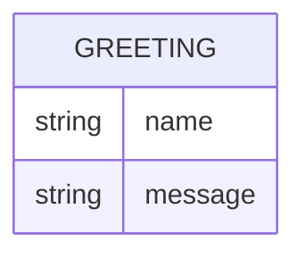

# Greeter — Domain Model

The domain is minimal: a single Greeting produced on request for a given name.

```mermaid
erDiagram
    GREETING {
        string name
        string message
    }
```

A Greeting is not persisted — it exists only as the response to one request.